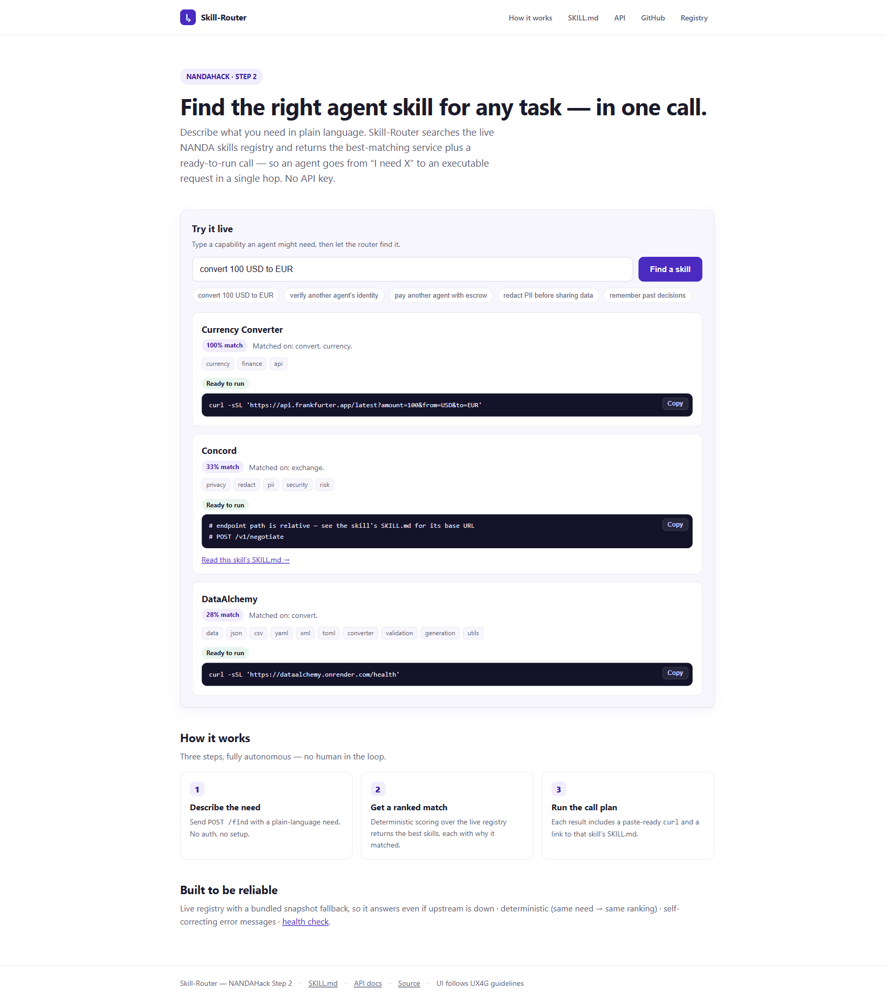

# Skill-Router

Find the right agent skill for any task, in one call. An AI agent says what it
needs in plain words, and Skill-Router searches the live
[NANDA skills registry](https://nandatown.projectnanda.org/skills) and hands back
the best matches. Each one comes with a call plan the agent can run right away. One
hop from "I need X" to a real call.

Built for NANDAHack (Step 2). The agent-facing docs are in [`SKILL.md`](./SKILL.md).



## Why it stands out

- **It fills a real gap.** The registry has dozens of skills but no way for an agent
  to find and call the right one by intent. This is that missing piece.
- **It stays up.** Reads the live registry, but ships with a bundled snapshot
  ([`data/registry_snapshot.json`](data/registry_snapshot.json)), so it still answers
  if the upstream is down.
- **It hands back a runnable call.** When your need has the values in it (like
  "convert 100 USD to EUR"), it fills the endpoint placeholders and marks the call
  `ready_to_run`.
- **It's deterministic and needs no key.** No LLM in the hot path, so the same need
  always returns the same ranking. Easy for an agent to verify and retry.
- **Errors explain themselves.** Every error response says how to fix the call.

## Run it locally

```bash
python -m venv .venv
. .venv/Scripts/activate        # Windows: .venv\Scripts\activate   |   macOS/Linux: source .venv/bin/activate
pip install -r requirements.txt
uvicorn app.main:app --reload --port 8000
```

```bash
curl -sS http://127.0.0.1:8000/health
curl -sS -X POST http://127.0.0.1:8000/find \
  -H 'Content-Type: application/json' \
  -d '{"need": "convert 100 USD to EUR", "top_k": 3}'
```

Open `http://127.0.0.1:8000/` for the landing page and live search, or `/docs` for
the API docs.

## Endpoints

| Method | Path | Purpose |
|---|---|---|
| POST | `/find` | Search skills by natural-language need. |
| GET | `/skills` | List every indexed skill. |
| GET | `/skill/{id}` | Full detail and call plan for one skill. |
| POST | `/refresh` | Reload the registry from upstream. |
| GET | `/health` | Liveness and indexed-skill count. |
| GET | `/skill.md` | The agent-facing SKILL.md. |

## Tests

```bash
pip install pytest
pytest -q
```

The tests force the bundled snapshot, so they run offline with no network.

## Deploy

- **Render:** connect the repo. `render.yaml` is included (free web service, health
  check at `/health`).
- **Railway, Fly, or others:** a `Procfile` is included
  (`uvicorn app.main:app --host 0.0.0.0 --port $PORT`).

After it's live, replace `https://YOUR-DEPLOYMENT-URL` in `SKILL.md` with your real
host and submit `SKILL.md` on the NANDA skills page.

## How it's laid out

```
app/
  main.py       FastAPI app, routes, call-plan builder
  registry.py   live-registry loader with snapshot fallback (thread-safe)
  matching.py   deterministic IDF-weighted relevance scoring, no external deps
  synth.py      fills endpoint placeholders from the need
  static/       landing page and live search UI
data/
  registry_snapshot.json   offline fallback copy of the registry
tests/
  test_skill_router.py
SKILL.md        agent-facing documentation
```
